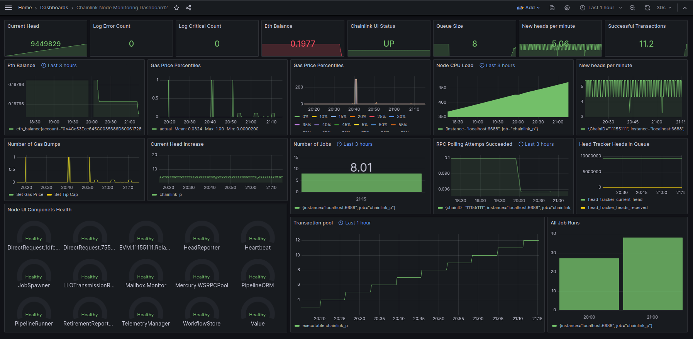
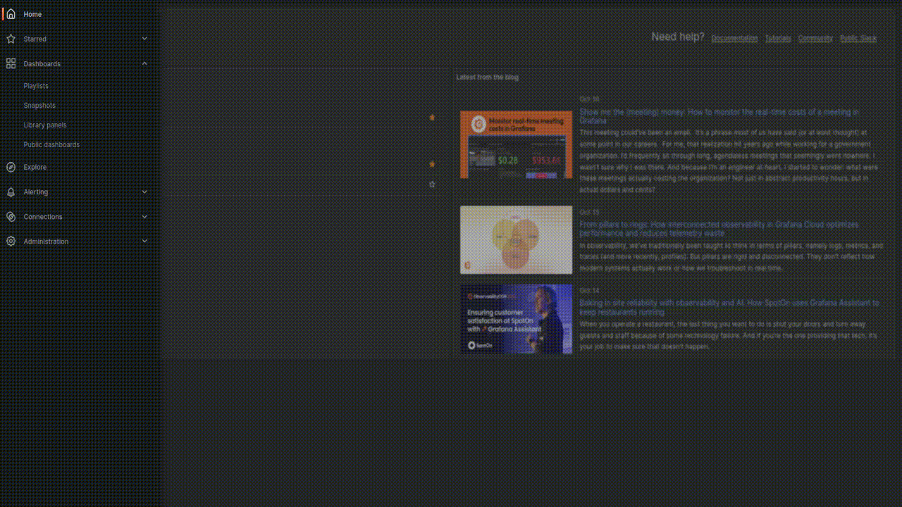

# Chainlink Node Monitoring with Prometheus and Grafana
This guide outlines how to monitor and alert on key health indicators of a Chainlink node using Prometheus and Grafana.



## Dashboard Monitoring Scope
The Grafana dashboard is designed to monitor the following critical metrics:
- **Wallet Balance Monitoring**  
  Tracks the node’s available Ether to ensure it can pay for gas and continue executing jobs.
- **Transaction Lifecycle**  
  Observes confirmed, unconfirmed, and replaced transactions to assess how reliably the node is submitting and finalizing on-chain activity.
- **RPC Connectivity and Reliability**  
  Monitors the success and failure rates of RPC calls and connection attempts to ensure stable communication with blockchain nodes.
- **Job Pipeline Health**  
  Tracks queued pipelines and tasks to detect bottlenecks or delays in job execution.
- **Gas Price Behavior**  
  Visualizes current gas price estimates and priority fee settings to help optimize transaction costs and responsiveness.
- **Log Severity Tracking**  
  Counts error and critical log entries to surface operational issues and potential system failures.
- **Block Sync Status**  
  Monitors the latest block received, the rate of new blocks, and any dropped headers to ensure the node stays in sync with the chain.
- **Head Tracker Performance**  
  Measures queue depth and callback execution time to detect processing delays or resource bottlenecks.
- **Resource Usage**  
  Tracks CPU consumption over time to identify performance trends and capacity needs.
- **Service Availability**  
  Verifies whether the node and its monitoring stack are reachable and internally healthy.


## Prerequisites
To set up Chainlink monitoring, you'll need the following tools:
- **Prometheus** (default port: `9090`)  
  A powerful open-source monitoring system that collects and stores time-series data. It scrapes metrics from your Chainlink node and other services, making them available for analysis and alerting.
- **Grafana** (default port: `3000`)  
  A flexible visualization platform that connects to Prometheus and displays your metrics through interactive dashboards. It also supports alerting, making it ideal for tracking node health and performance in real time.
- A running Chainlink node exposing metrics on port 6688


## Prometheus Configuration
Edit your prometheus.yml file (typically located at /etc/prometheus/prometheus.yml) to include your Chainlink node:
```
scrape_configs:
  - job_name: 'Chainlink_Node_1'
    scrape_interval: 5s
    scrape_timeout: 5s
    static_configs:
      - targets: ['localhost:6688']
    authorization:
      credentials: 'mysecuretokenforPrometheus'  # Must match the AuthToken in secrets.toml
```
Note: The AuthToken is required to access the Chainlink metrics endpoint and must match the value in your node’s secrets.toml.


## Grafana Setup
- Log in to Grafana (http://localhost:3000) with default credentials admin/admin
- Change your password
- Add a new data source:
- Type: Prometheus
- URL: http://localhost:9090
- Click Save & Test




## Security Best Practices
Monitoring infrastructure often exposes sensitive metrics and interfaces. To ensure your Chainlink node and observability stack remain secure, follow these best practices:

Restrict Metrics Endpoints
- Bind Prometheus, Grafana, and Chainlink metrics ports to `127.0.0.1` to prevent external access.
- Alternatively, expose them only through a secure VPN or SSH tunnel.
- Example for Prometheus:
  ```bash
  --web.listen-address=127.0.0.1:9090
  ```
  
Use Firewalls or Reverse Proxies
- Configure firewalls (e.g., ufw, iptables) to block public access to ports 6688, 9090, and 3000.
- Use reverse proxies like NGINX to:
- Add HTTPS encryption
- Enforce authentication
- Rate-limit requests

Rotate AuthTokens Regularly
- The Chainlink node’s metrics endpoint requires an AuthToken (defined in secrets.toml) for Prometheus to scrape metrics.
- Rotate this token periodically and update both:
- secrets.toml in the Chainlink node
- prometheus.yml under the authorization.credentials field

**Reminder:** Metrics can reveal internal job IDs, RPC health, and gas usage — all of which could be exploited if exposed publicly.


## Metric Glossary
This section explains key Prometheus metrics exposed by the Chainlink node and what they represent in your Grafana dashboard.

| Metric | Description |
|--------|-------------|
| `eth_balance` | Current ETH balance of the Chainlink node. Critical for ensuring the node can pay for gas. |
| `tx_manager_num_confirmed_transactions` | Total number of transactions successfully confirmed on-chain by the node. |
| `tx_manager_num_unconfirmed_transactions` | Transactions sent but not yet confirmed. High values may indicate congestion or RPC issues. |
| `tx_manager_num_replaced_transactions` | Transactions that were replaced due to nonce conflicts or gas price updates. |
| `evm_pool_rpc_node_calls_failed` | Chainlink metric that tracks the number of failed RPC calls made to EVM-compatible blockchain nodes. |
| `pipeline_runs_queued` | Number of full job pipelines waiting to start. Indicates job backlog. |
| `pipeline_task_runs_queued` | Number of individual tasks within pipelines that are queued. Useful for spotting task-level delays. |
| `gas_updater_all_gas_price_percentiles` | Current gas price percentiles (e.g., 50th, 90th, 99th). Useful for estimating transaction costs. |
| `pool_rpc_node_polls_success` | Number of successful polling attempts to RPC nodes. Reflects RPC health. |
| `pool_rpc_node_polls_error` | Number of failed polling attempts to RPC nodes. High values may indicate connectivity issues. |
| `log_error_count` | Total number of log entries classified as error. These typically indicate recoverable issues like failed job runs, RPC timeouts, or misconfigurations. |
| `log_critical_count` | Total number of log entries classified as critical. These signal severe problems that may prevent the node from functioning properly — such as database corruption, failed startup, or persistent RPC failures. |
| `head_tracker_current_head` | Most recent block number that node has received from the blockchain. |
| `head_tracker_heads_received` | Counts of the total number of block headers received by the node from the blockchain. |
| `gas_updater_set_gas_price` | The base fee (in wei) that the Chainlink node sets for transactions. Reflects current network congestion and fee market conditions. |
| `gas_updater_set_tip_cap` | The priority fee (tip) added on top of the base fee to incentivize miners/validators. Helps ensure faster inclusion in blocks. |
| `process_cpu_seconds_total` | Prometheus metric that tracks the total cumulative CPU time consumed by a process, measured in seconds. |
| `up` | Prometheus metric that indicates whether a target is reachable. Used to monitor the availability of: Chainlink nod or Prometheus itself. |
| `health` | Chainlink node metric that reports the internal health status of the node. |

