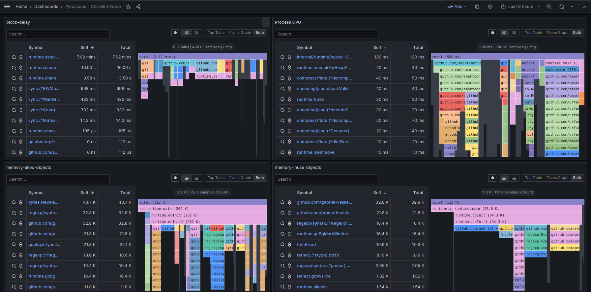

## High-Level Setup: Pyroscope for Chainlink Node in Docker
This guide walks through setting up continuous profiling for a Chainlink node using Pyroscope, and visualizing performance data in Grafana alongside existing Prometheus metrics.



## Prerequistites
- Chainlink node running in Docker (port 6688)
- Prometheus + Grafana already configured (port 9090 and 3000)
- Pyroscope server running in Docker (default port 4040) 

## Step-by-Step Setup
### 1. Run Pyroscope Server
```bash
docker run -d \
  --name pyroscope_server \
  -p 127.0.0.1:4040:4040 \
  grafana/pyroscope:latest \
  server
```
This exposes Pyroscope’s UI and ingestion endpoint at http://localhost:4040.


### 2. Configure Chainlink Node for Profiling
Update your config.toml and secrets.toml with:
```toml
#config.toml
[Pyroscope]
ServerAddress = 'http://host.docker.internal:4040'
Environment = 'testnet'

#secrets.toml
[Pyroscope]
AuthToken = "mysecuretokenforPyroscope"
```
Use host.docker.internal if Pyroscope is on your host and Chainlink is in Docker. If both are in Docker, use the container name or Docker network alias.


### 3. Verify profiling is active
```bash
docker logs <chainlink-node-name> | grep -i pyroscope
```
And try to look for 

```
Profiler started: sending data to http://host.docker.internal:4040
```

If docker is configured properly, Visit http://localhost:4040 — you should see chainlink-node in the dropdown.

### 4. Connect Pyroscope to Grafana
- Navigate to Grafana → Data Sources → Add
- Select Pyroscope
- Set the URL to http://localhost:4040
- Click Save & Test

## Future Development Considerations To further enhance observability:
- Use Pyroscope for continuous profiling and flame graph analysis
- Leverage Prometheus queries to detect job anomalies
- Improve logging to surface unexpected or harmful behavior
